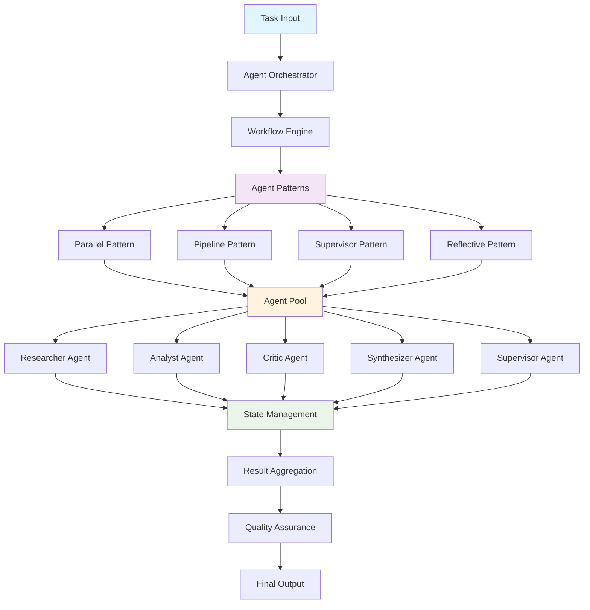
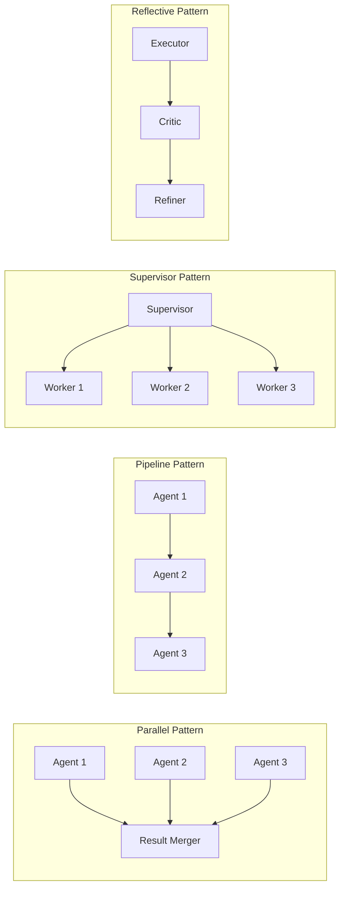
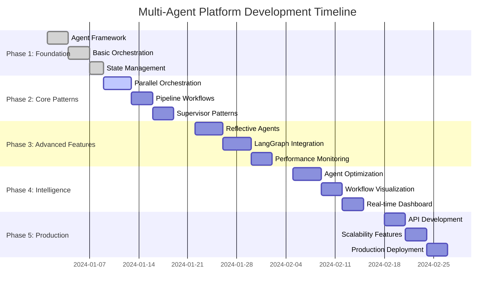

# 🤖 Multi-Agent Orchestration Platform - Project Manifest

**Advanced Multi-Agent Coordination & Workflow Orchestration Platform**

## 🎯 Project Vision

Revolutionary multi-agent orchestration platform that enables sophisticated AI agent collaboration through LangGraph workflows. Provides intelligent task distribution, real-time coordination, and scalable agent management for complex problem-solving scenarios.

## 🏗️ Architecture Overview

### **Multi-Agent System Design**



### **Orchestration Patterns**



## 🚀 Technology Stack

### **Core Orchestration**
- **🐍 Python 3.8+** - Core platform development
- **🔗 LangGraph** - Agent workflow orchestration
- **🔄 LangChain** - Agent framework and tools
- **📊 LangSmith** - Monitoring and observability
- **🤖 CrewAI** - Multi-agent coordination
- **⚡ FastAPI** - REST API for orchestration
- **📦 Redis** - State management and caching

### **Agent Intelligence**
- **🧠 OpenAI GPT-4** - Advanced reasoning capabilities
- **🤖 Anthropic Claude** - Alternative LLM integration
- **🔍 Tavily** - Web search and research
- **📊 LangSmith** - Performance tracking
- **🛠️ Custom Tools** - Specialized agent capabilities

### **Workflow Management**
- **📋 Pydantic** - Data validation and schemas
- **🔄 Asyncio** - Asynchronous processing
- **📊 Monitoring** - Performance and cost tracking
- **🎯 Load Balancing** - Agent resource management

## 📋 Implementation Phases



## 🎯 Core Orchestration Components

### **1. Workflow Engine**
**Purpose**: Intelligent task distribution and agent coordination

**Capabilities**:
- Dynamic workflow generation
- Agent task assignment optimization
- Real-time state management
- Failure recovery and retry logic
- Performance optimization

### **2. Agent Patterns**
**Purpose**: Predefined coordination patterns for different scenarios

**Capabilities**:
- **Parallel Pattern**: Concurrent task execution
- **Pipeline Pattern**: Sequential processing workflows
- **Supervisor Pattern**: Hierarchical task management
- **Reflective Pattern**: Self-improving agent loops

### **3. State Management**
**Purpose**: Centralized coordination and data sharing

**Capabilities**:
- Shared memory across agents
- State persistence and recovery
- Conflict resolution
- Data consistency guarantees
- Version control for agent states

### **4. Performance Monitor**
**Purpose**: Real-time orchestration monitoring and optimization

**Capabilities**:
- Agent performance tracking
- Cost monitoring and optimization
- Workflow efficiency analysis
- Resource utilization metrics
- Automated scaling decisions

## 🗂️ Project Structure

```
portfolio-multi-agent-orchestration/
├── docs/project_manifest.md    # 📋 This project blueprint
├── quick_start.py              # 🚀 5-minute orchestration demo
├── requirements.txt            # 📦 Core dependencies
├── pyproject.toml             # 📋 Package configuration
│
├── src/                       # 🔧 Core orchestration logic
│   ├── agents/                # Individual agent implementations
│   ├── patterns/              # Orchestration patterns
│   ├── workflows/             # LangGraph workflows
│   ├── orchestration/         # Core orchestration engine
│   ├── monitoring/            # Performance tracking
│   └── tools/                 # Agent tools and utilities
│
├── data/                      # 📊 Workflow data
│   ├── samples/               # Demo workflows
│   ├── schemas/               # Data validation
│   └── performance/           # Monitoring data
│
├── examples/                  # 📚 Working examples
│   ├── basic_examples/        # Simple orchestration patterns
│   ├── advanced_examples/     # Complex multi-agent workflows
│   ├── parallel_examples/     # Parallel processing demos
│   ├── pipeline_examples/     # Sequential workflow demos
│   ├── supervisor_examples/   # Hierarchical patterns
│   └── reflective_examples/   # Self-improving workflows
│
├── infrastructure/            # ☁️ Deployment
│   ├── monitoring/            # Observability setup
│   └── aws/                   # Cloud deployment
│
└── tests/                     # 🧪 Testing suite
```

## 🎯 Success Criteria

### **Orchestration Performance**
- **Sub-second** workflow initiation
- **99.9% uptime** for agent coordination
- **Linear scalability** up to 100 concurrent agents
- **Cost optimization** through intelligent routing

### **Agent Coordination**
- **Intelligent task distribution** based on agent capabilities
- **Fault tolerance** with automatic failover
- **Real-time collaboration** between agents
- **Quality assurance** through multi-agent validation

### **Business Impact**
- **80% faster** complex problem solving
- **Scalable intelligence** for enterprise workflows
- **Automated quality control** through agent collaboration
- **Cost-effective** AI operation at scale

---

**This manifest serves as the blueprint for building a comprehensive multi-agent orchestration platform that enables sophisticated AI collaboration through intelligent workflow management.**